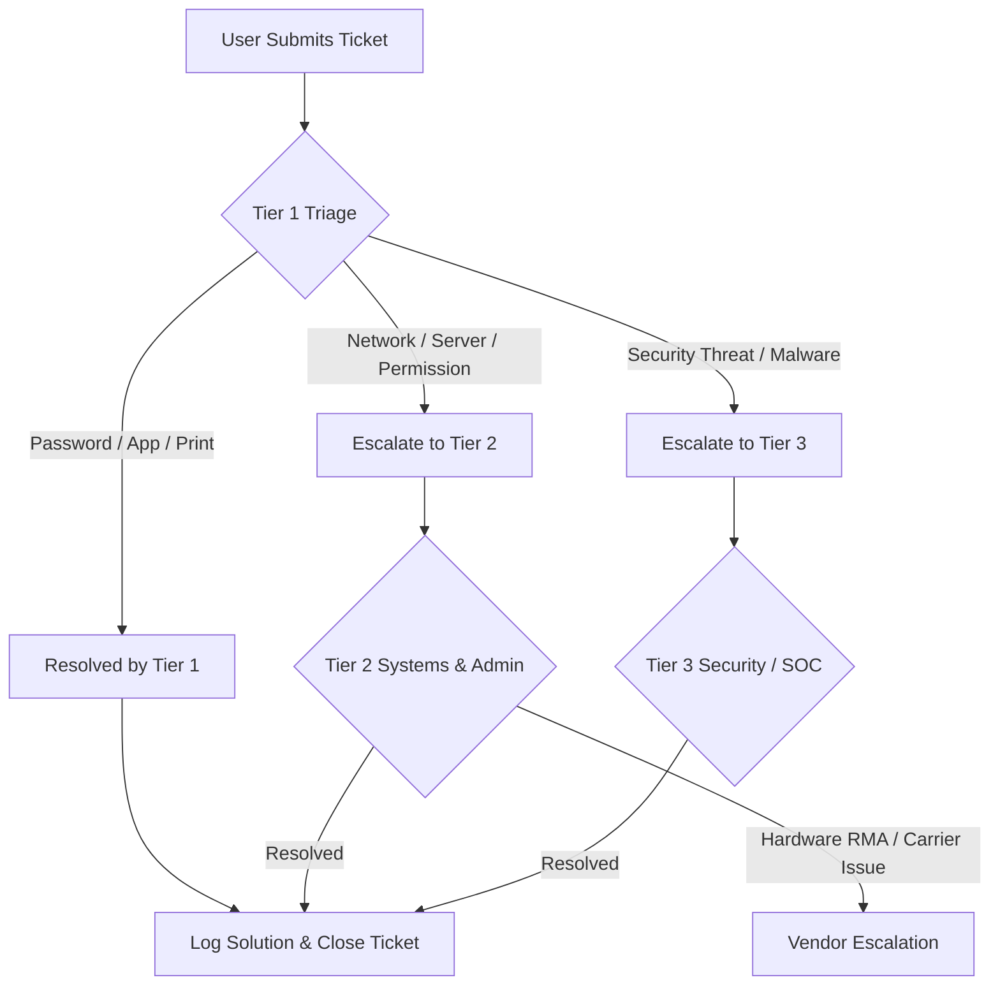

```mermaid
graph TD
    A[User Submits Ticket] --> B{Tier 1 Triage}
    B -->|Password / App / Print| C[Resolved by Tier 1]
    C --> D[Log Solution & Close Ticket]
    
    B -->|Network / Server / Permission| E[Escalate to Tier 2]
    E --> F{Tier 2 Systems & Admin}
    F -->|Resolved| D
    F -->|Hardware RMA / Carrier Issue| G[Vendor Escalation]
    
    B -->|Security Threat / Malware| H[Escalate to Tier 3]
    H --> I{Tier 3 Security / SOC}
    I -->|Resolved| D
```
