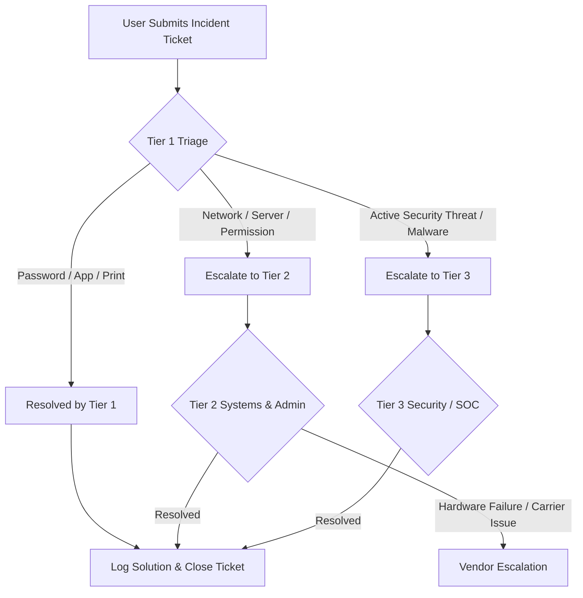

# Standard Operating Procedure: Incident Escalation Matrix & Service Level Agreements (SLAs)

**Document ID:** SOP-IT-003  
**Version:** 1.0  
**Effective Date:** September 2026  
**Target Audience:** Service Desk Technicians, Systems Analysts, IT Operations Managers  

---

## 1. Purpose & Scope
This Standard Operating Procedure defines ticket severity classifications, initial triage response expectations, Service Level Agreements (SLAs), and clear escalation pathways for IT incidents across Tier 1, Tier 2, and Tier 3 engineering teams.

---

## 2. Ticket Severity Classifications & SLAs

| Severity Level | Priority | Incident Description | First Response SLA | Target Resolution SLA |
| :--- | :--- | :--- | :--- | :--- |
| **P1 - Critical** | Emergency | Enterprise-wide outage; core infrastructure down (e.g., primary network link, Active Directory, server rack failure). | **15 Minutes** | **2 Hours** |
| **P2 - High** | Major | Department-level outage; major application unavailable affecting multiple users with no immediate workaround. | **30 Minutes** | **4 Hours** |
| **P3 - Medium** | Standard | Single-user operational impact (e.g., workstation boot failure, specialized software crash, email sync error). | **2 Hours** | **24 Hours** |
| **P4 - Low** | Minor | General inquiry, non-urgent request, asset move, password reset, or new software request. | **4 Hours** | **48 Hours** |

---

## 3. Incident Escalation Workflow

---

## 4. Tier Responsibilities & Escalation Triggers

### Tier 1: Service Desk / Operations Support
* **Scope:** Initial ticket triage, account unlocks, password resets, basic software troubleshooting, printer connectivity, and initial device staging.
* **Escalation Trigger:** If an incident cannot be resolved within **15 minutes** of active troubleshooting, or if the issue requires domain/network changes, escalate to Tier 2.

### Tier 2: Systems Administration & Network Engineering
* **Scope:** Server operating system issues, Active Directory Group Policy adjustments, VLAN routing, firewall policy modifications, host-based firewall adjustments, and hardware diagnostics.
* **Escalation Trigger:** Escalates to Tier 3 or vendor support if a hardware component requires RMA, a major ISP circuit is down, or security alerts flag malicious lateral movement.

### Tier 3: Cybersecurity & Enterprise Architecture
* **Scope:** Security Incident Response, active malware containment, network architecture redesigns, major database corruption, and critical infrastructure failure.

---

## 5. Executive & Critical Incident Escalation
For **P1 Critical** incidents affecting core business operations:
1. Notify the **IT Operations Manager** and **VP of IT** via phone within **15 minutes** of incident confirmation.
2. Open an active **Major Incident Bridge** (Teams/Conference Line) updated every **30 minutes**.
3. Document all root causes and mitigation actions in a formal **Post-Incident Review (PIR)** report within 24 hours of resolution.
